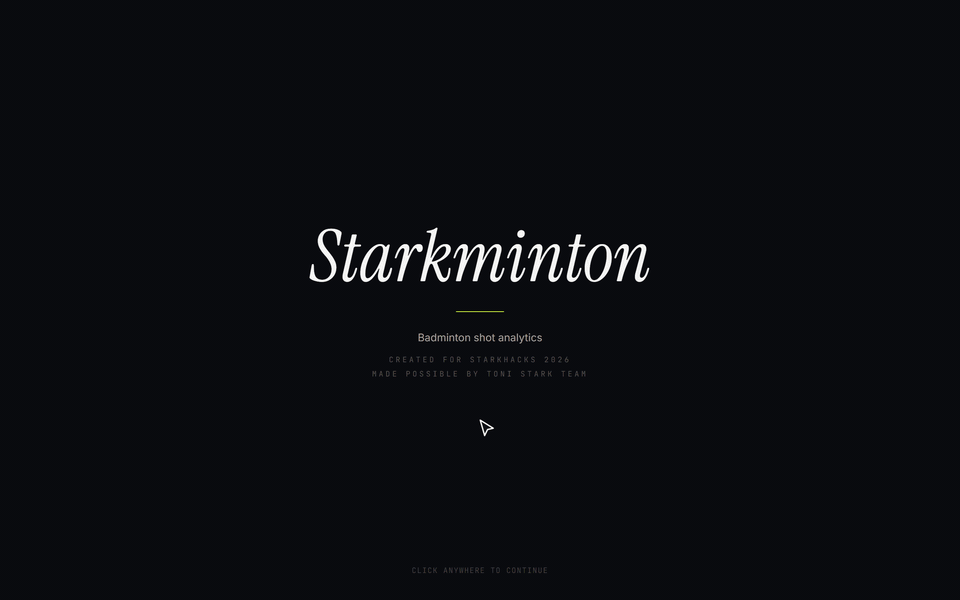
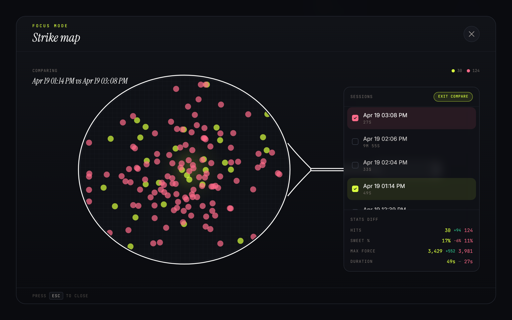
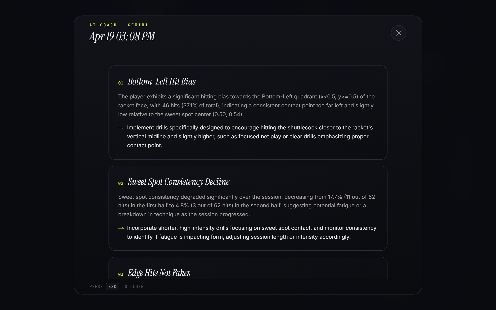
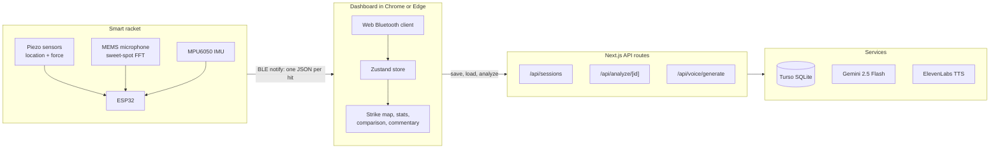

# Starkminton

A smart badminton racket and live dashboard that shows where every hit lands, how hard it was, and whether it found the sweet spot.

**[Live demo](https://starkminton-mauve.vercel.app)** · [How it works](#how-it-works) · [Try it](#try-it) · [Hardware contract](docs/HARDWARE_CONTRACT.md)



Team Starkminton built this at StarkHacks, Purdue University, in April 2026. Sensors in the racket head locate each hit and classify it by sound. An ESP32 sends each hit to the browser over Bluetooth Low Energy. The dashboard plots it live, saves sessions, and turns them into coaching feedback.

## Why it works this way

- **No app to install.** The dashboard talks to the racket through the Web Bluetooth API in Chrome or Edge. A player opens a URL, clicks Connect, and starts hitting.
- **One small JSON message per hit.** The racket does the signal processing and sends only `{x, y, force, sweet, t}`. The dashboard never touches raw sensor data, so the firmware and web teams worked in parallel against a [written contract](docs/HARDWARE_CONTRACT.md) and a mock generator that emits the same format.

## Highlights

- **Live strike map.** Every hit appears on the racket head as it happens. Sweet-spot hits are filled, off-spot hits are hollow, and the latest hit is ringed.
- **Sweet-spot detection by sound.** A MEMS microphone and frequency analysis on the racket classify each hit, instead of guessing from position alone.
- **Session comparison.** Focus mode overlays two saved sessions on one racket head and diffs hits, sweet-spot rate, max force, and duration.

  

- **AI Coach.** Gemini reads a session as CSV and returns three specific insights, each with an observation and a drill.

  

- **Live voice commentary.** ElevenLabs voices 30 commentary lines at load. The dashboard picks a line from the last five hits: streaks, hard hits, misses, and hit-count milestones.
- **CSV export.** Any saved session downloads as a CSV with summary metadata and one row per hit.
- **Mock mode.** A toggle generates realistic hits, clustered near the sweet spot, so the dashboard runs without the racket.

## How it works



Each hit carries normalized coordinates on the string bed (`x`, `y` from `0` to `1`), a raw force reading from the piezo ADC (`0` to `4095`), and the microphone's `sweet` verdict. The dashboard keeps the live session in memory. **Save session** writes it and its hits to Turso through Drizzle. The AI Coach route rebuilds the session as CSV, sends it to Gemini with a coaching prompt, and returns strict JSON. The [hardware contract](docs/HARDWARE_CONTRACT.md) defines the BLE service, UUIDs, and message format.

## Tech stack

| Layer | Tools |
|---|---|
| Racket | ESP32, piezo sensors, MEMS microphone, MPU6050 |
| Transport | Bluetooth Low Energy (Nordic UART Service), Web Bluetooth API |
| Frontend | Next.js 14 (App Router), TypeScript, HeroUI, Tailwind CSS, Framer Motion, Zustand |
| Storage | Turso (libSQL), Drizzle ORM, local SQLite fallback |
| AI | Gemini 2.5 Flash (coaching), ElevenLabs (voice commentary) |
| Hosting | Vercel |

## Try it

### Live demo, no racket needed

1. Open the [live demo](https://starkminton-mauve.vercel.app).
2. Click **Start session**, then turn on **Mock hits**.
3. Open the strike map in focus mode and click **Compare** to overlay two saved sessions.

### Run it locally

```bash
npm install
cp .env.example .env.local   # leave it empty to use a local SQLite file
npm run db:push
npm run dev
```

Open http://localhost:3000. Mock mode, the strike map, and saved sessions work without keys. The AI Coach needs `GEMINI_API_KEY`, and voice commentary needs `ELEVENLABS_API_KEY`.

To share sessions across a team, use Turso:

1. Create a database: `turso db create smash-dashboard`.
2. Get the URL: `turso db show smash-dashboard --url`.
3. Get a token: `turso db tokens create smash-dashboard`.
4. Set `TURSO_DATABASE_URL` and `TURSO_AUTH_TOKEN` in `.env.local`.

### Browser requirements

Web Bluetooth works only in Chrome or Edge on desktop. Safari does not support it, so Mac users need Chrome to connect the racket. Mock mode works in any modern browser.

## Hardware integration

The ESP32 advertises as `SmashRacket-*` and sends one JSON hit per BLE notification. See [`docs/HARDWARE_CONTRACT.md`](docs/HARDWARE_CONTRACT.md) for the service UUIDs, fields, commands, and Arduino example.

## Project structure

```
app/                  Next.js pages and API routes
  api/sessions/       Save, list, load, and delete sessions
  api/analyze/[id]/   AI Coach (Gemini)
  api/voice/generate/ Commentary audio (ElevenLabs)
components/           Dashboard cards, strike map, focus mode, AI Coach
lib/
  bluetooth.ts        Web Bluetooth client
  mock.ts             Mock hit generator
  commentary*.ts      Commentary lines and line selection
  csv.ts              Session CSV for export and AI Coach
  store.ts            Zustand state
db/                   Drizzle schema and client
docs/                 Hardware contract, README media
scripts/              README media capture
```

## Development notes

- Use mock mode to test without the ESP32.
- The database stores timestamps in UTC. The dashboard shows them in the user's local time zone.
- Coordinates are normalized to `[0, 1]` across the racket string bed.
- To refresh the README media after a UI change, run `uv run --with playwright python scripts/capture_media.py`. The script needs ffmpeg. It drives the live deployment in mock mode and never saves a session.

## Credits

Built by Team Starkminton at StarkHacks, Purdue University:

- **Babega**: piezo signal processing, hit coordinates and localization
- **Barrack**: MEMS microphone and frequency analysis, sweet-spot detection
- **Aubreyasta**: ESP32 and MPU6050, connection to the web dashboard
- **Winner**: web dashboard

## License

[MIT](LICENSE)
